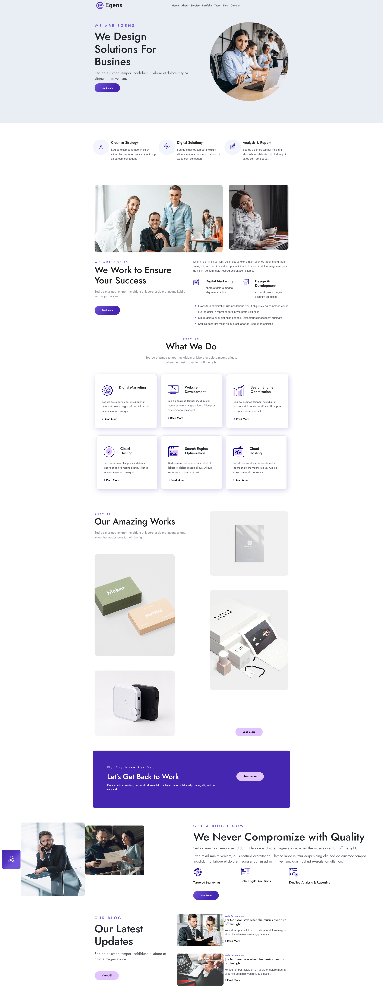

# EGENS

EGENS is a landing page for a fictional company that provides e-commerce solutions. It is built with Bootstrap, CSS, HTML, and JavaScript.

## Features

- Responsive design that adapts to different screen sizes and devices

- Footer with social media icons and links

## Installation

To install EGENS, follow these steps:

1. Clone or download this repository to your web server directory.
2. Open the `index.html` file in your browser or navigate to the URL of your web server.

## Feedback

If you have any feedback or suggestions for EGENS, you can contact me at https://www.linkedin.com/in/ahmed-tarek-34993826b/ or open an issue on this repository.

## 
